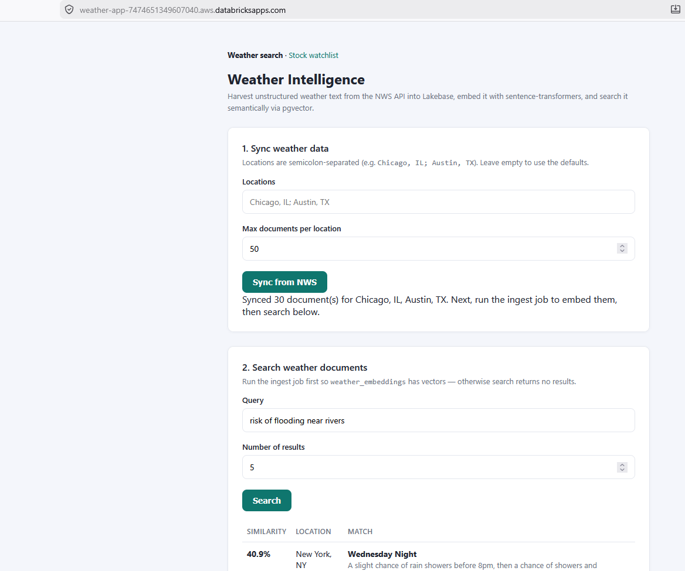
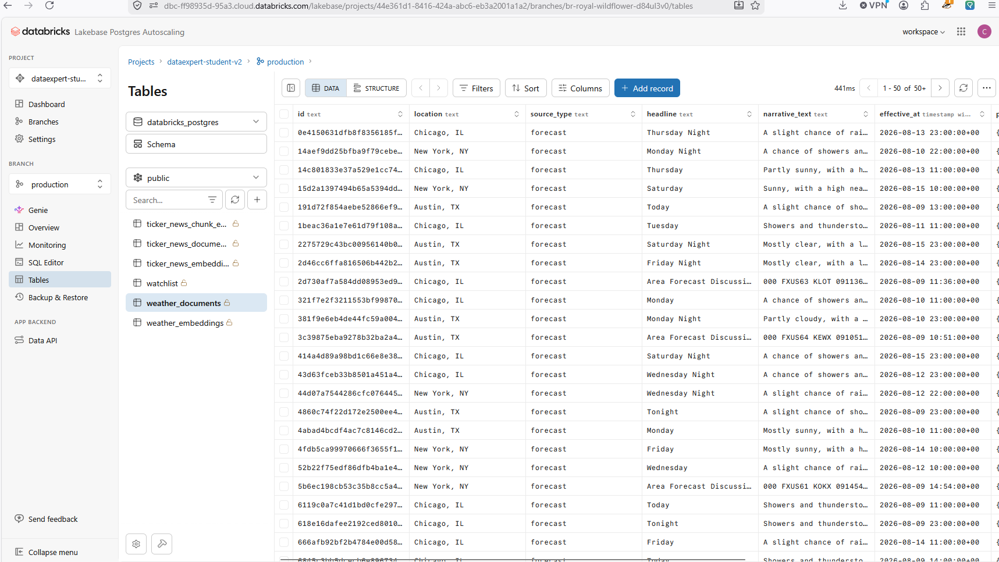
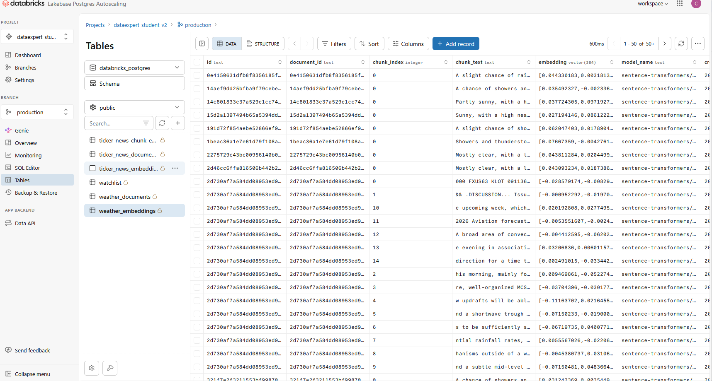

# The Rise of the AI Data Engineer - Homework Day 2

This repository contains my second homework project for  **[The Rise of the AI Data Engineer](https://learn.dataexpert.io/)** bootcamp by Zach Wilson in August 2026, focusing on AI data engineering on Databricks with Lakebase (Databricks-managed Postgres) and vector search.

## Project: Weather Intelligence — Unstructured Data → Lakebase Vector Search → REST API

A weather intelligence system that harvests **unstructured weather text from the National Weather Service API**, vectorizes it into Lakebase (`Postgres + pgvector`), and exposes a semantic search endpoint for natural-language weather queries.



### Pipeline Architecture

```
NWS (alerts + forecast discussions + gridpoint forecast)
        │  normalize → document records
        ▼
POST /weather/sync  ──upsert──►  weather_documents (Lakebase)
                                      │  read unembedded rows
                                      ▼
                    notebooks/ingest_weather_embeddings.py
                                      │  chunk (800/100) → embed (384-dim)
                                      ▼
                              weather_embeddings (pgvector + HNSW)
                                      │  cosine search (<=>)
                                      ▼
                 POST /weather/search  {"query": "flash flood risk this weekend"}
```

### Features

* **Real-time weather data ingestion** from NWS API (alerts, forecast discussions, gridpoint forecasts)
* **Vector embeddings** with `sentence-transformers/all-MiniLM-L6-v2` (384-dim)
* **Semantic search** over weather narratives using pgvector + HNSW index
* **REST API** endpoints for syncing and searching weather data
* **Lakebase integration** (Databricks-managed Postgres with vector extensions)
* **Automated ETL** via scheduled Databricks Workflow

### Data Sources

* **[NWS API](https://api.weather.gov)** (free, no API key) - provides rich unstructured weather text:
  - Active weather alerts with descriptions and instructions
  - Area Forecast Discussions (free-text forecast narratives)
  - Gridpoint forecast periods with detailed forecasts
* **[Open-Meteo Geocoding API](https://open-meteo.com/docs/geocoding-api)** - resolves city names to coordinates
* **Coverage**: United States only (NWS limitation)

### Technology Stack

* **Backend**: Flask REST API deployed as a Databricks App
* **Database**: Lakebase (Postgres + pgvector extension)
* **Vector Search**: HNSW index for fast cosine similarity search
* **Embeddings**: `sentence-transformers/all-MiniLM-L6-v2`
* **ETL**: Databricks Workflow with scheduled notebook execution
* **Text Processing**: Chunking with 800-char windows, 100-char overlap

### Data Storage

**weather_documents table:**


Stores raw weather data with fields: `id`, `location`, `source_type`, `headline`, `narrative_text`, `effective_at`, `payload` (JSONB), `synced_at`.

**weather_embeddings table:**


Stores vector embeddings with fields: `id`, `document_id` (FK), `chunk_index`, `chunk_text`, `embedding` (VECTOR(384)), `model_name`, `created_at`. Includes HNSW index for fast semantic search.

### API Endpoints

* `GET /healthz` - Health check
* `POST /weather/sync` - Harvest weather data from NWS API
  - Body: `{"locations": ["Chicago, IL", "Austin, TX"], "limit": 50}`
  - Creates document records in Lakebase
* `POST /weather/search` - Semantic search over weather narratives
  - Body: `{"query": "risk of flooding near rivers", "top_k": 5}`
  - Returns top matches ranked by cosine similarity

### Example Search Query

```bash
curl -X POST https://<app-url>/weather/search \
  -H "Content-Type: application/json" \
  -d '{"query": "flash flood risk this weekend", "top_k": 5}'
```

Returns:
```json
{
  "query": "flash flood risk this weekend",
  "top_k": 5,
  "results": [
    {
      "id": "...",
      "location": "Chicago, IL",
      "source_type": "alert",
      "headline": "Flash Flood Warning",
      "chunk_text": "...",
      "similarity": 0.53
    }
  ]
}
```

### 📁 See the [`weather-app/`](weather-app/) folder for:

* Complete setup and deployment instructions
* Detailed schema documentation
* ETL notebook implementation
* SQL table definitions
* Databricks Workflow configuration
* Known limitations and improvements

### Reference Boilerplate (Previous)

For the original Massive + Lakebase boilerplate app (stock/news data syncing), see [`README_BOILERPLATE.md`](README_BOILERPLATE.md).

## Repository Structure

```
databricks-lakebase-app-day-2/
├── README.md                           # This file - Weather Intelligence project
├── README_BOILERPLATE.md              # Original Massive API boilerplate
├── screenshots/                        # Demo screenshots
│   ├── app_deployment_on_databricks.png
│   ├── databricks_lakebase_table_documents.png
│   └── databricks_lakebase_table_embeddings.png
├── weather-app/                        # Weather Intelligence homework (Day 2)
│   ├── README_WEATHER.md              # Full weather project documentation
│   ├── app.py                         # Flask API with weather endpoints
│   ├── weather_client.py              # NWS + Open-Meteo API client
│   ├── embeddings.py                  # Embedding model loader and helpers
│   ├── lakebase.py                    # Lakebase connection helper
│   ├── app.yaml                       # Databricks App config
│   ├── requirements.txt
│   ├── notebooks/
│   │   └── ingest_weather_embeddings.py  # ETL: chunk → embed → upsert
│   ├── sql/
│   │   ├── 05_setup_weather_documents.sql
│   │   └── 06_setup_weather_embeddings.sql
│   ├── resources/
│   │   └── ingest_weather_embeddings_job.yml  # Workflow config
│   └── templates/
│       └── index.html
├── templates/                          # Boilerplate watchlist UI
├── sql/                                # Boilerplate SQL schemas
├── notebooks/                          # Boilerplate ETL notebooks
├── resources/                          # Boilerplate Workflow configs
├── app.py                              # Boilerplate Flask app
├── lakebase.py                         # Lakebase connection helper
├── massive_client.py                   # Massive API client (boilerplate)
└── setup_secrets.py                    # Secret configuration utility
```

## Quick Start

1. **Prerequisites**: Lakebase instance with native-password role, Python 3.10+
2. **Sync weather data**: `POST /weather/sync` with location list
3. **Generate embeddings**: Run `notebooks/ingest_weather_embeddings.py` (or schedule as Workflow)
4. **Search**: `POST /weather/search` with natural-language query

See the [`weather-app/`](weather-app/) folder for complete setup instructions and deployment steps.
